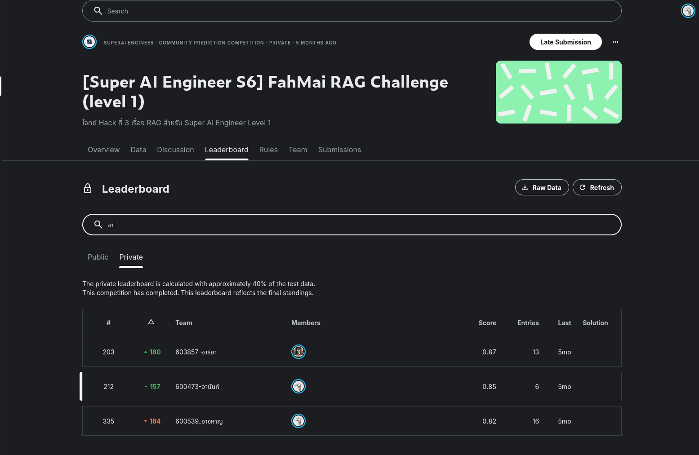
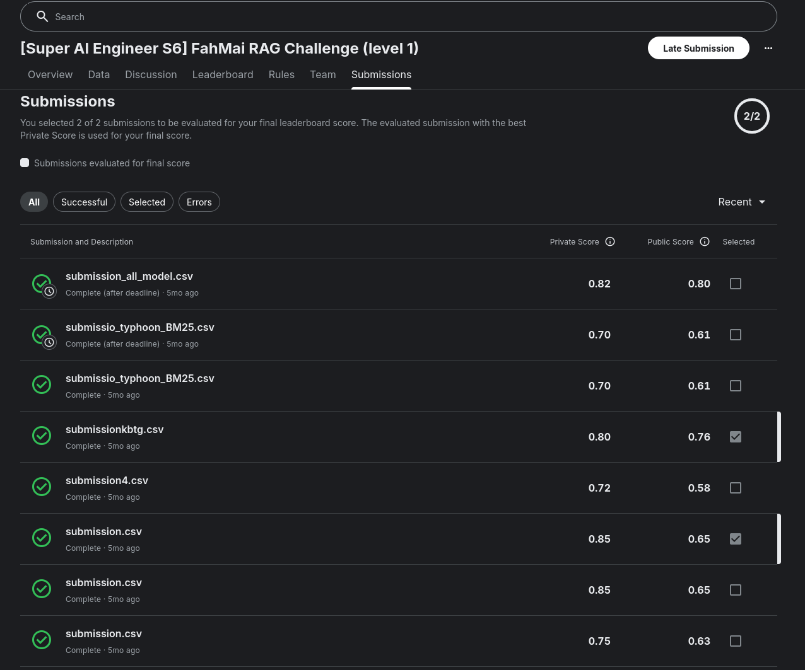

# 2. FahMai RAG Challenge — LLM / RAG

Part of the [Super AI Engineer Season 6](../README.md) hackathon series — a 48-hour Retrieval-Augmented
Generation (RAG) challenge. See the root README for the challenge brief and Kaggle competition link.

## Task

Build a RAG pipeline that answers multiple-choice questions about the fictional "FahMai" electronics
store, grounded in a small knowledge base, using the ThaiLLM API for generation.

## Notebooks — 3 iterations

The folder keeps all three attempts, in the order they were built:

| Notebook | Embeddings | Approach | Submission | Private / Public score |
|---|---|---|---|---|
| [`FahMai_RAG.ipynb`](FahMai_RAG.ipynb) | `paraphrase-multilingual-MiniLM-L12-v2` | Starter-kit baseline: dense / BM25 / hybrid (RRF) retrieval, compared across 4 LLMs (typhoon, openthaigpt, pathumma, kbtg) with majority "super vote" | — | ~0.70–0.72 |
| [`FahMai_RAG_all_model_.ipynb`](FahMai_RAG_all_model_.ipynb) | `BAAI/bge-m3` | Advanced pipeline: hybrid retrieval + cross-encoder reranking, multi-model consensus voting across all 4 LLMs | `submission_all_model.csv` | 0.82 / 0.80 |
| **[`FahMai_RAG_Real.ipynb`](FahMai_RAG_Real.ipynb)** ⭐ | `BAAI/bge-m3` | Same advanced pipeline, but locked to a single best-performing LLM (`kbtg`) instead of voting across all 4 — turned out more accurate than the multi-model consensus | **`submission.csv`** | **0.85 / 0.65** |

**Best submission: `FahMai_RAG_Real.ipynb`.** Swapping the MiniLM embeddings for BGE-M3 (a stronger
multilingual retrieval model) and settling on `kbtg` as the single generation model — rather than voting
across four LLMs — gave the best private leaderboard score of the three.

## Result

Final private leaderboard score: **0.85**, rank **212 / ~500** (jumped 157 places from the public
leaderboard).

## Discussion

The biggest single gain across the three iterations came from swapping the embedding model — MiniLM
(`FahMai_RAG.ipynb`) to BGE-M3 (the other two) — not from adding the cross-encoder reranker or the voting
logic on top. More surprising: **multi-model consensus voting across all 4 LLMs underperformed just
trusting the single best model (`kbtg`)** — averaging in weaker models' answers apparently diluted correct
ones more than it corrected wrong ones. For this kind of grounded multiple-choice QA, a well-chosen single
strong generator beat an ensemble vote. The private score also jumped 157 ranks above the public score,
suggesting the public leaderboard subset wasn't fully representative — a reminder not to over-trust the
public score alone when picking a final submission.

## Other files

- `submission.csv` — final selected submission (from `FahMai_RAG_Real.ipynb`)
- `submission_all_model.csv` — from `FahMai_RAG_all_model_.ipynb`'s multi-model voting approach
- `submissionkbtg.csv` — an earlier single-model (`kbtg`) run, before the BGE-M3 embedding swap
