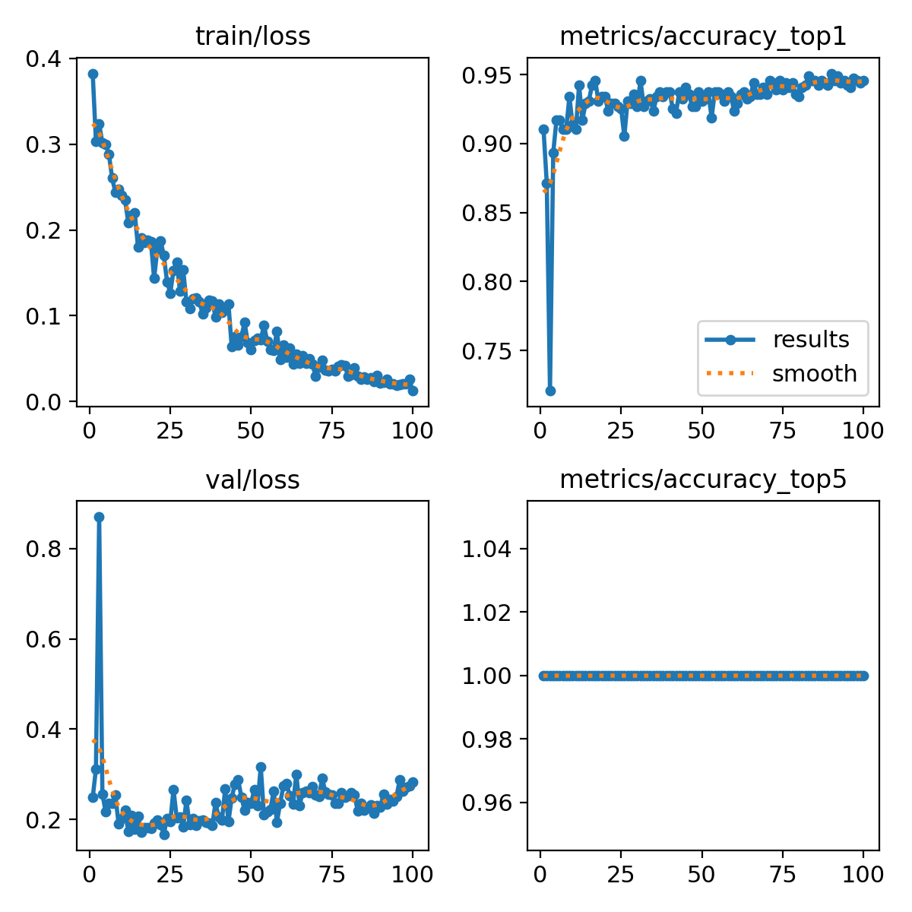
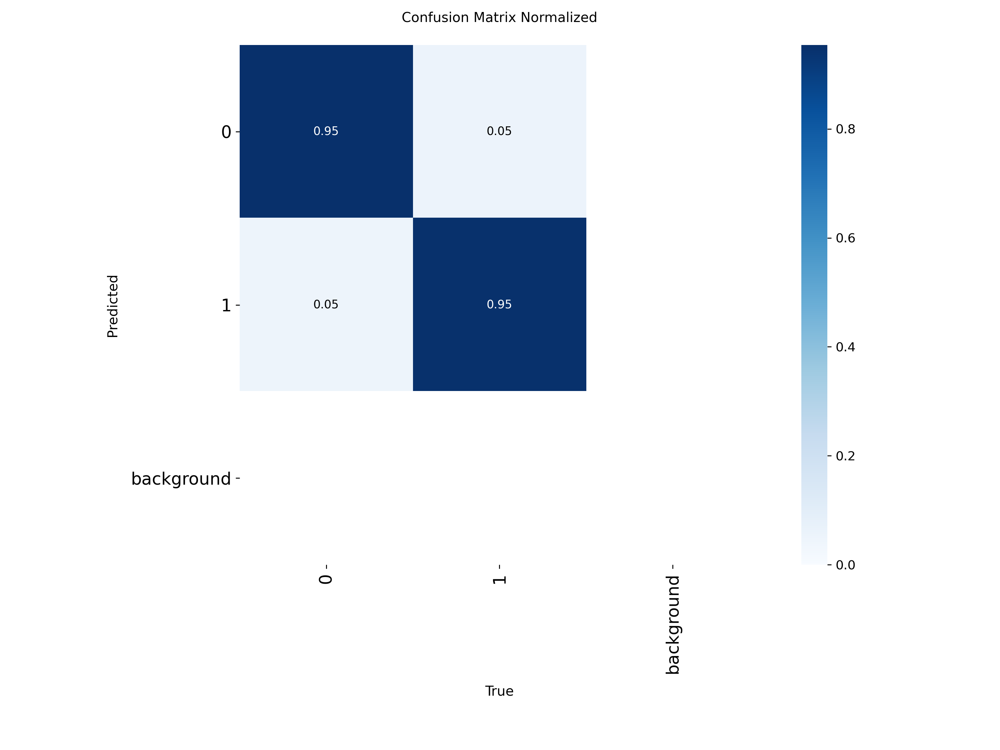
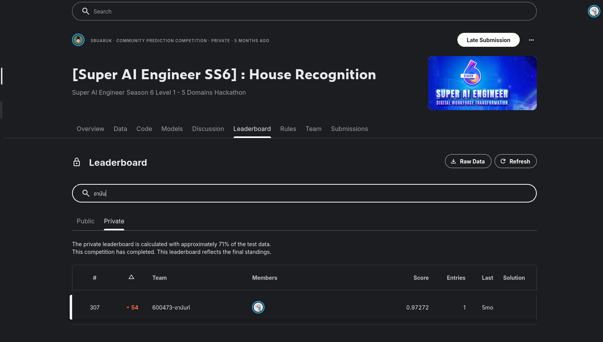
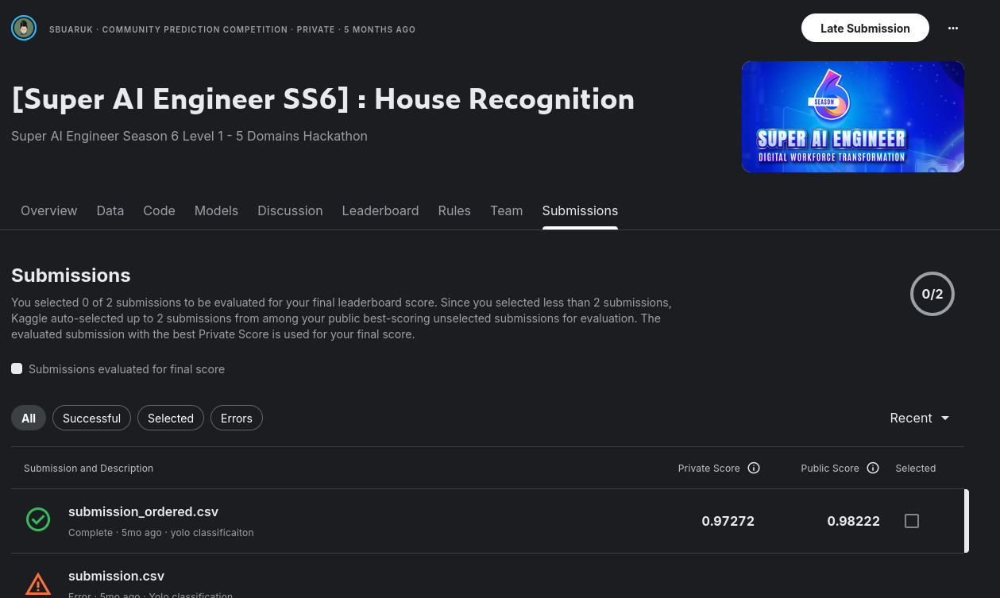

# 3.1 House Recognition

Part of the [Super AI Engineer Season 6](../README.md) hackathon series — one of the four tracks in the
24-hour sprint. Competition: **[Super AI Engineer SS6] House Recognition** (Level 1, "5 Domains
Hackathon"). See the root README for the Kaggle link.

## Task

Binary image classification: given a house photo, predict class `0` or `1`.

## Approach

[`House Recognition.ipynb`](House%20Recognition.ipynb) fine-tunes a YOLO classification model:

1. **Prepare the dataset** — restructure the raw `train.csv` + images into the folder layout Ultralytics
   expects for classification (`classification_dataset/train/<class>/`, `.../val/<class>/`), and write a
   `data.yaml` describing 2 classes (`nc: 2`, `names: ['0', '1']`).
2. **Train** — `yolo26s-cls.pt` (pretrained), fine-tuned for 100 epochs, batch size 16, image size 640,
   default augmentation (mosaic, random flip, HSV jitter). Trained on Kaggle's GPU runtime (`classify/train/`
   holds the full run: weights, per-epoch metrics, and diagnostic plots).
3. **Predict** — load `classify/train/weights/best.pt`, run inference over every test image, take the
   top-1 class per image.
4. **Submission** — merge predictions onto `sample_submission.csv`'s `id` order to guarantee every
   required row is present and correctly ordered → [`submission_ordered.csv`](submission_ordered.csv).

## Training results

Final epoch (100/100): **94.6% top-1 validation accuracy**, 100% top-5 (trivial for a 2-class problem).
The confusion matrix is close to symmetric — both classes are recognized about equally well (95% / 5%
each way), so there's no class the model is biased against.

| Loss & accuracy curves | Confusion matrix (normalized) |
|---|---|
|  |  |

## Result

Final private leaderboard score: **0.97272** (public: 0.98222), rank **307** — down 54 places from the
public leaderboard. Only one submission was made, so Kaggle auto-selected it for final scoring.

## Discussion

A pretrained YOLO classification backbone, fine-tuned with no special tricks, was enough to clear 94%+
validation accuracy — binary classification on visually distinct house photos turned out to be one of the
easier tracks in the sprint. The symmetric confusion matrix means the model isn't biased toward either
class, so there was little left to gain from class-weighting or threshold tuning. The 54-place drop from
public to private rank (still a very high 0.97+ score either way) is most likely just leaderboard-split
noise at this accuracy ceiling, not a sign of overfitting. Only one submission was ever made, so there was
no experimentation with other backbones, image sizes, or test-time augmentation — worth trying if
squeezing out the last fraction of a percent mattered, but with returns likely to be marginal.

## Files

- [`House Recognition.ipynb`](House%20Recognition.ipynb) — full pipeline: dataset prep, training,
  inference, submission
- `classify/train/` — Ultralytics training run output (`args.yaml`, `weights/best.pt` + `last.pt`,
  `results.csv`, batch/validation sample images, confusion matrices)
- `submission_ordered.csv` — final submission
