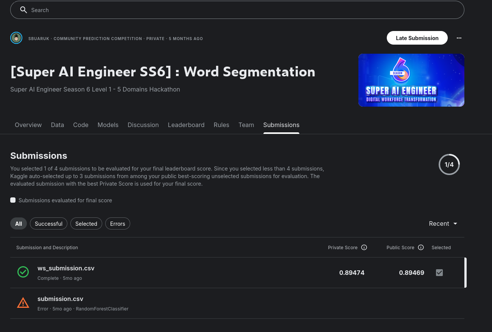
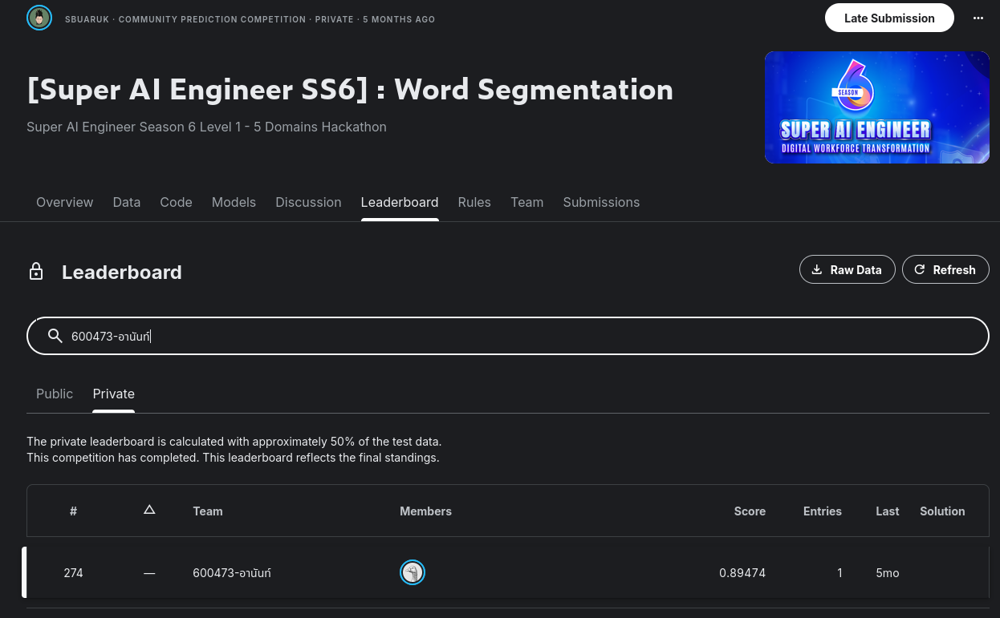

# 3.2 Word Segmentation

Part of the [Super AI Engineer Season 6](../README.md) hackathon series — one of the four tracks in the
24-hour sprint. Competition: **[Super AI Engineer SS6] Word Segmentation** (Level 1, "5 Domains
Hackathon"). See the root README for the Kaggle link.

## Task

Character-level Thai word segmentation using the **LST20** corpus's BIO tagging scheme: for every
non-whitespace character in the test text, predict one of `B_WORD` (word start) / `I_WORD` (word
interior) / `E_WORD` (word end) — a single-character word is tagged `B_WORD` only. Scored by **macro
F1**. See [`LST20 Annotation Guideline.pdf`](LST20%20Annotation%20Guideline.pdf) /
[`LST20 Brief Specification.pdf`](LST20%20Brief%20Specification.pdf) for the corpus's original labeling
spec.

## Approach

[`Word Segmentation.ipynb`](Word%20Segmentation.ipynb) / [`run_segmentation.py`](run_segmentation.py)
(same pipeline, script form) — a tokenizer + gradient-boosting ensemble:

1. **Tokenizer ensemble** — run PyThaiNLP's `newmm` (dictionary-based longest-matching + probabilistic
   disambiguation) and `longest` (pure longest-match) tokenizers over the raw test text, split into
   whitespace-delimited chunks. Convert each tokenizer's word boundaries into BIO labels per character,
   and align them back to the original character sequence (tokenizers can insert/drop characters, so
   alignment is done chunk-by-chunk with a fallback for mismatches).
2. **Soft ensemble probabilities** — average the two tokenizers' label distributions per character
   (falling back to `B_WORD` where neither resolves) as a prior signal.
3. **Feature engineering** — per character: Thai character class (consonant / leading or following
   vowel / tone mark / digit / other), a ±5-character sliding window of those classes, and a handful of
   hand-built structural features (leading-vowel-before-consonant, tone-mark-preceded, Thai/non-Thai
   script transition).
4. **LightGBM classifier** — a `LGBMClassifier` (multiclass, 400 estimators, early stopping) trained on
   those features using the tokenizer ensemble's labels as pseudo-labels.
5. **Final ensemble** — blend tokenizer-ensemble probabilities (weight 0.65) with the LightGBM
   probabilities (weight 0.35), then take the argmax per character.
6. **BIO repair** — a post-processing pass that fixes invalid transitions (e.g. an `I_WORD`/`E_WORD`
   that doesn't follow a `B_WORD`/`I_WORD` gets corrected to `B_WORD`), and forces the first character to
   `B_WORD`.
7. **Submission** — write `Id, Predicted` for every non-whitespace character position, matching
   [`ws_sample_submission.csv`](ws_sample_submission.csv)'s row order/IDs exactly.

## Data

- [`ws_test.txt`](ws_test.txt) — raw Thai test text (single blob, whitespace-separated)
- [`ws_list.txt`](ws_list.txt) — the 3 label classes: `['B_WORD', 'E_WORD', 'I_WORD']`
- [`ws_sample_submission.csv`](ws_sample_submission.csv) — submission template (`Id` = 1-indexed
  position among non-whitespace characters)
- [`ws_submission.csv`](ws_submission.csv) — final submission (35,182 rows)

## Result

Final private leaderboard score: **0.89474** (public: 0.89469), rank **274**. `ws_submission.csv` was
the selected/scored submission — a separate `RandomForestClassifier` attempt errored out and wasn't used.

## Discussion

The rule-based tokenizer ensemble (`newmm` + `longest`) turned out to be a strong prior on its own — the
LightGBM classifier only had to nudge those pseudo-labels rather than learn segmentation from scratch,
which is likely why the hybrid approach was both robust and fast to build. A separate pure-ML attempt
(`RandomForestClassifier` on the same character features, without the tokenizer prior) errored out and was
abandoned, which suggests the tokenizer ensemble's BIO labels were doing most of the real work — a
character classifier with no linguistic prior struggled more. The BIO-repair post-processing step (fixing
invalid `I_WORD`/`E_WORD` transitions) was a small but necessary detail: without it, per-character argmax
predictions can produce label sequences that aren't valid segmentations at all. A natural next step would
be replacing the independent per-character classification with a proper sequence model (CRF or BiLSTM-CRF)
that models label transitions directly instead of repairing them after the fact.
