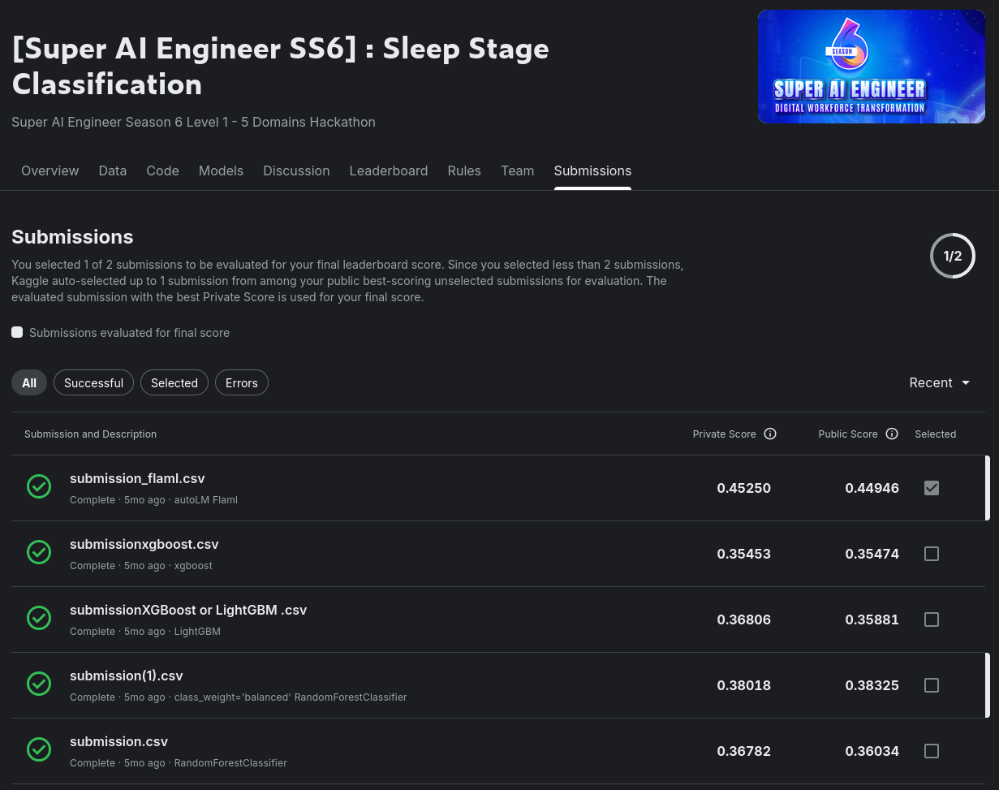
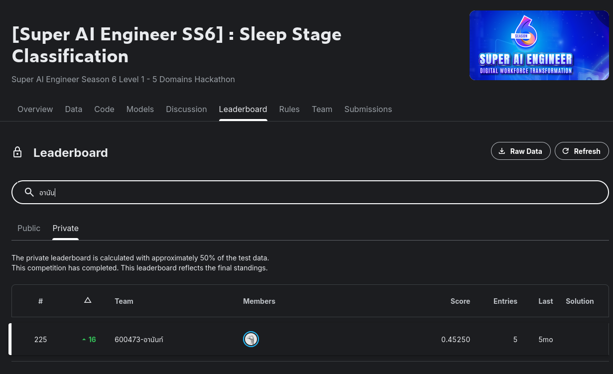

# 3.3 Sleep Stage Classification

Part of the [Super AI Engineer Season 6](../README.md) hackathon series — one of the four tracks in the
24-hour sprint. Competition: **[Super AI Engineer SS6] Sleep Stage Classification** (Level 1, "5 Domains
Hackathon"). See the root README for the Kaggle link.

## Task

Multi-class sleep stage classification from wearable-sensor time series: per-patient CSV recordings of
`BVP` (blood volume pulse / PPG) and 3-axis accelerometer (`ACC_X`, `ACC_Y`, `ACC_Z`) sampled at 16 Hz,
segmented into fixed windows, each window labeled one of 5 sleep stages — **`W`** (wake), **`N1`**,
**`N2`**, **`N3`**, **`R`** (REM). `N1` is called out in the notebook as the hardest class to get right
and gets extra tuning attention.

## Approach

[`Sleep Stage Classification.ipynb`](Sleep%20Stage%20Classification.ipynb) tries several modeling
approaches in sequence, on the same feature pipeline:

1. **Data prep** — load every patient's raw sensor CSV, concatenate with a `patient_id` column, and
   segment each patient's signal into fixed windows of `WINDOW_SIZE = 480` samples (30 s at 16 Hz).
   Aggregate each window down to a feature row: mean/std of `BVP`, `ACC_X`, `ACC_Y` (and `ACC_Z`) per
   segment, giving one row + one stage label per 30-second window.
2. **RandomForestClassifier** — baseline model on the aggregated window features. **Public score 0.38325.**
3. **XGBoost / LightGBM** — gradient-boosted trees baseline. **Public score 0.35474**, then both models
   are hyperparameter-tuned with `RandomizedSearchCV` (tuning `num_leaves`, `max_depth`, `learning_rate`,
   `n_estimators`, `subsample`, `colsample_bytree` for LightGBM), specifically aimed at improving recall
   on the hard `N1` class — classification reports are compared before/after tuning for both the
   RandomForest and LightGBM models.
4. **1D-CNN** — a small Keras `Sequential` 1D convolutional network (`Conv1D` → `BatchNorm` →
   `MaxPooling1D`/`GlobalAveragePooling1D` → `Dense`, softmax output) trained directly on the
   standardized per-window feature vectors (reshaped to `(samples, features, 1)`), 20 epochs.
5. **FLAML AutoML** (final approach) — `flaml.AutoML` re-run over the same windowed/aggregated features,
   auto-selecting and tuning a model. This is the version whose predictions were submitted as
   [`submission_flaml.csv`](submission_flaml.csv) and it's the best-scoring of all five approaches tried.

## Result

**`submission_flaml.csv`** (FLAML AutoML) was the selected/scored submission — final private leaderboard
score **0.45250** (public: 0.44946), rank **225 / ~500** (up 16 places from the public leaderboard). It
clearly outperformed every earlier attempt on the leaderboard: RandomForest (0.368 / 0.360 and, with
`class_weight='balanced'`, 0.380 / 0.383), XGBoost (0.355 / 0.355), and tuned LightGBM (0.368 / 0.359).

## Discussion

The biggest surprise here: letting FLAML search over models/hyperparameters automatically beat every
hand-picked approach, including a purpose-built 1D-CNN. That says the bottleneck wasn't model choice but
the **features** — mean/std over 30-second windows of just `BVP` + accelerometer is a coarse summary of a
biosignal, with no clinical EEG channel to lean on, so it's genuinely hard to tell `N1` (a brief,
low-amplitude transitional stage) apart from `W` or `N2` from that alone. All five approaches landed in a
fairly narrow 0.35–0.45 band, which reinforces that this is a feature/data ceiling rather than a modeling
one. If revisiting this, frequency-domain features (e.g. heart-rate-variability bands from the BVP signal)
or a model that sees the raw window sequence directly (rather than only its aggregated mean/std) would
likely matter more than further tuning the classifier itself.

## Files

- [`Sleep Stage Classification.ipynb`](Sleep%20Stage%20Classification.ipynb) — full pipeline: data
  loading/segmentation, feature engineering, and all 5 modeling approaches (RandomForest → XGBoost/
  LightGBM tuned → 1D-CNN → FLAML AutoML)
- `submission_flaml.csv` — final selected submission (FLAML AutoML), 7,832 rows
