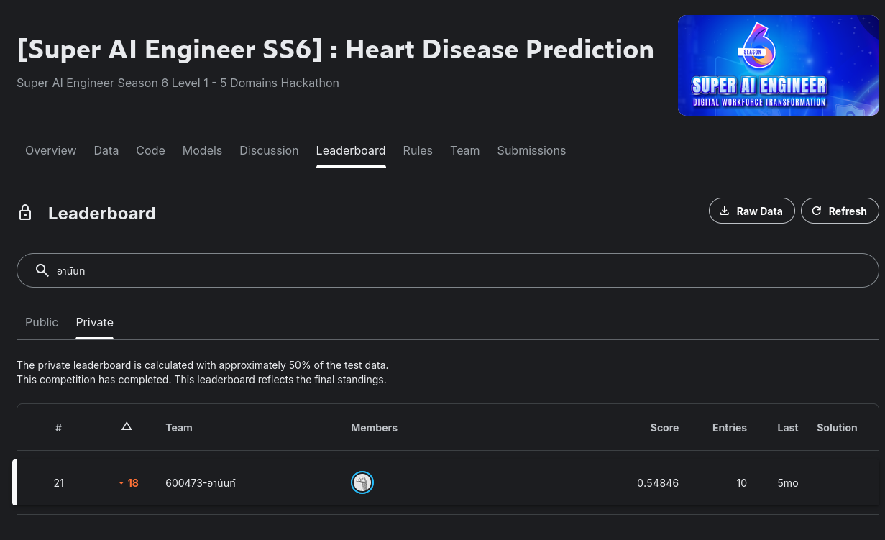
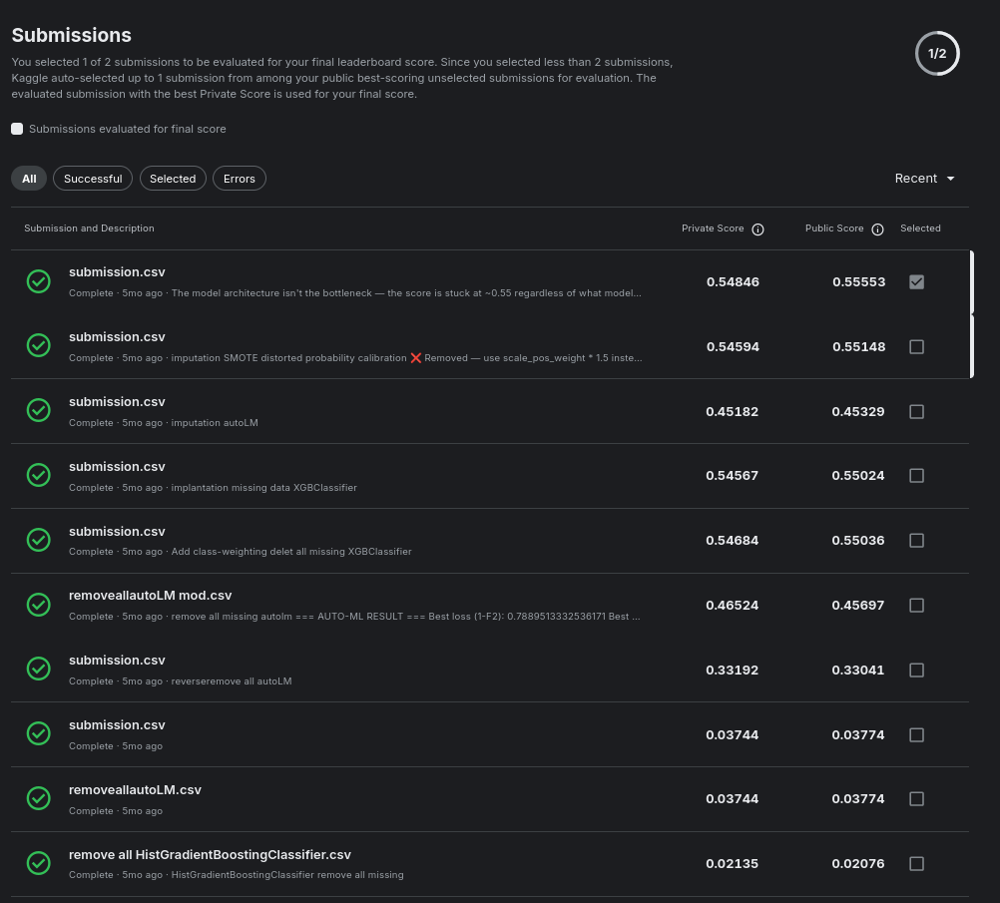

# 3.4 Heart Disease Prediction

Part of the [Super AI Engineer Season 6](../README.md) hackathon series — one of the four tracks in the
24-hour sprint. Competition: **[Super AI Engineer SS6] Heart Disease Prediction** (Level 1, "5 Domains
Hackathon"). See the root README for the Kaggle link.

## Task

Binary classification on a BRFSS-style health survey: predict `History of HeartDisease or Attack`
(`Yes`/`No`) from features like High Blood Pressure, High Cholesterol, Cholesterol Checked, Body Mass
Index, Smoked 100+ Cigarettes, etc. Several features (including the target itself) have missing values.
Scored on **F2** (`fbeta_score`, β=2 — weights recall higher than precision), and the classes are
imbalanced (~70% No / ~30% Yes in the final submission).

## Approach

Two notebooks, tried across many iterations:

- [`heart_disease_prediction.ipynb`](heart_disease_prediction.ipynb) — drops only rows missing the
  *target* label, keeps other missing values; versions 1–4 (XGBoost baseline → an ensemble of stronger
  models with recall-focused tuning → Optuna + LightGBM hyperparameter search → FLAML AutoML with a custom
  F2 scoring function).
- [`heart disease prediction  drop missing all.ipynb`](heart%20disease%20prediction%20%20drop%20missing%20all.ipynb) —
  drops every row with *any* missing value instead; versions 5–6 (FLAML AutoML, then a final XGBoost
  pass), reusing the same shared `preprocess()` pattern (categorical `Yes`/`No` → 0/1, one-hot encoding
  for the rest, column alignment between train/test).

Across both notebooks the submission history (10 entries) shows a lot of experimentation with the
imbalance/missing-data handling itself: SMOTE oversampling, class-weighting via `scale_pos_weight`,
dropping vs. imputing missing rows, and AutoML vs. hand-picked models. The **final selected submission**
is a class-weighted XGBoost classifier (`scale_pos_weight`-based, no SMOTE) trained on the
drop-missing-target data.

## Result

Final private leaderboard score: **0.54846** (public: 0.55553), rank **21 / ~500** — down 18 places from
the public leaderboard.

## Discussion

The submission history makes the real bottleneck visible: scores cluster tightly in the **0.54–0.55**
band across XGBoost, LightGBM, and FLAML AutoML runs alike, exactly as the final submission's own
description notes — *"the model architecture isn't the bottleneck, the score is stuck at ~0.55 regardless
of what model..."*. What did move the score was how missing data and class imbalance were handled: SMOTE
oversampling was tried and dropped because it distorted probability calibration (bad for an F2-optimized
threshold), in favor of `scale_pos_weight`-based class weighting. A couple of early AutoML submissions
scored dramatically lower (0.02–0.04) — almost certainly a label-encoding/inversion bug (the codebase's
final label-remapping step, which flips `Yes`/`No` after prediction, hints at this being fixed mid-stream)
rather than a genuinely bad model. The lesson: for a tabular problem this size, feature/label handling and
the imbalance strategy mattered far more than model choice or hyperparameter search.

## Files

- [`heart_disease_prediction.ipynb`](heart_disease_prediction.ipynb) — versions 1–4: XGBoost baseline,
  ensemble + recall tuning, Optuna/LightGBM, FLAML AutoML (drop-missing-target data)
- [`heart disease prediction  drop missing all.ipynb`](heart%20disease%20prediction%20%20drop%20missing%20all.ipynb) —
  versions 5–6: FLAML AutoML, final XGBoost (drop-any-missing data)
- `submission.csv` — final selected submission, 74,362 rows
